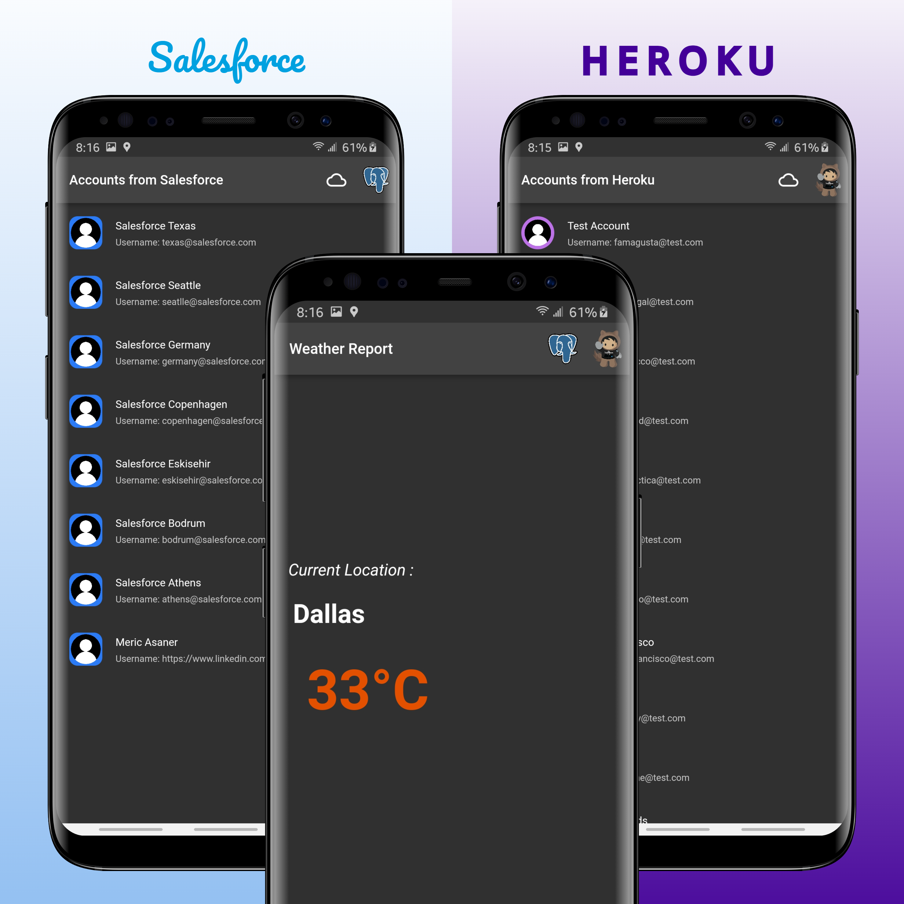

# Flutter App Demo
{: .fs-9 }

{: .fs-6 .fw-300 }

<!-- [Get started now](#getting-started){: .btn .btn-primary .fs-5 .mb-4 .mb-md-0 .mr-2 } [View it on GitHub](https://github.com/just-the-docs/just-the-docs){: .btn .fs-5 .mb-4 .mb-md-0 } -->

---

<!-- **New: version `0.4.0.rc1` has just been released! See [the changelog](https://github.com/just-the-docs/just-the-docs/blob/main/CHANGELOG.md) for a detailed breakdown!** -->

<!-- Improved compatibility of back to top link: See: https://github.com/othneildrew/Best-README-Template/pull/73 -->

<!-- PROJECT LOGO -->
 

    
  <h3 align="center">Flutter Demo App by Meric Asaner</h3>

  

    Integrated with Salesforce, Heroku, and OpenWeather!
     
     
    <a href="docs-assets/appgif.gif">View Demo</a>
    ·
    <a href="docs/architecture.html">View Architecture</a>
    ·
    <a href="https://github.com/masaner/Flutter_Salesforce_Heroku_Integration_Demo/issues">Report Bug</a>
    ·
    <a href="https://github.com/masaner/Flutter_Salesforce_Heroku_Integration_Demo/issues">Request Feature</a>
  

<!-- ABOUT THE PROJECT -->
## About The Project

This project shows some of the features that flutter has about displaying data from external sources such as Heroku and Salesforce. We are also able to benefit from the Rest Resources on Salesforce in the app by calling internal queries to return Accounts and also . If you have any suggestions on what should be done next or if you feel like something should be done in another way, please feel free to contribute.

This project displays the use of Salesforce and Heroku integrated into Flutter. The app is capable of retrieving the temperature of a given geolocation. 

Prerequisites:
* [Salesforce Developer Org](https://developer.salesforce.com/signup)
* [Heroku Account With PostgreSQL](https://signup.heroku.com/login)
* [OpenWeather API Key](https://home.openweathermap.org/users/sign_up)

I have also provided the Apex Classes in [this folder](docs/apex-code).

### Built With

* [![Flutter][Flutter]][Flutter-URL]
* [![Dart][Dart]][Dart-URL]
* [![Node.js][NodeJS]][NodeJS-URL]
* [![Salesforce Apex][Salesforce]][Salesforce-URL]
* [![Heroku / PostgreSQL][Heroku]][Heroku-URL]
* [![OpenWeather API][OpenWeather]][OpenWeather-URL]

<!-- CONTACT -->
## Contact

Meric Asaner - [@meric_asaner](https://twitter.com/meric_asaner) - meric.a.asaner@gmail.com

Project Link: [https://github.com/masaner/Flutter_Salesforce_Heroku_Integration_Demo](https://github.com/masaner/Flutter_Salesforce_Heroku_Integration_Demo)

(<a href="#readme-top">back to top</a>)

<!-- MARKDOWN LINKS & IMAGES -->
<!-- https://www.markdownguide.org/basic-syntax/#reference-style-links -->
[linkedin-shield]: https://img.shields.io/badge/-LinkedIn-black.svg?style=for-the-badge&logo=linkedin&colorB=555
[linkedin-url]: https://linkedin.com/in/meric-asaner
[product-screenshot]: docs-assets/App.png

[Flutter]: https://img.shields.io/badge/Flutter-35495E?style=for-the-badge&logo=flutter
[Flutter-URL]: https://flutter.dev/

[Dart]: https://img.shields.io/badge/Dart-35495E?style=for-the-badge&logo=dart&logoColor=2da1ff
[Dart-URL]: https://dart.dev/

[Heroku]: https://img.shields.io/badge/Heroku-634988?style=for-the-badge&logo=heroku&logoColor=white
[Heroku-URL]: https://id.heroku.com/signup/login

[Salesforce]: https://img.shields.io/badge/Salesforce-35495E?style=for-the-badge&logo=salesforce&logoColor=2da1ff
[Salesforce-URL]: https://developer.salesforce.com/signup

[NodeJS]:https://img.shields.io/badge/Node.js-517942?style=for-the-badge&logo=nodedotjs&logoColor=white
[NodeJS-URL]: https://nodejs.org/en/

[OpenWeather]: https://img.shields.io/badge/OpenWeather-orange
[OpenWeather-URL]: https://openweathermap.org/api
